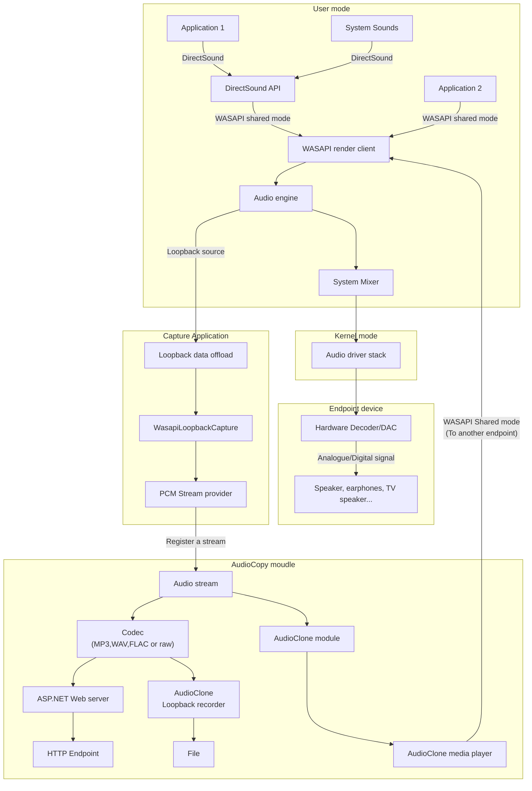

# AudioCopy - 投放你的音频到其他设备 Cast your audio to other devices

Readme is also available in [English](docs/readme_english.md)

下载AudioCopy

# 简介
你是不是为了把音频从一台设备投放到另一台设备上而发愁？有了AudioCopy，你不再需要为这种情况发愁了。
AudioCopy可以以几乎无损的音质、相对较低的延迟把一个设备上的音频投放到另一台设备上

# 功能列表
- [x] 投放音频
- [x] 同步媒体信息
- [x] 本地化
- [ ] 跨平台适配
- [ ] 把一个端点的音频复制到另一个断点
- [ ] 录制播放的音频

# AudioCopy 是如何工作的
下面是一个简化的工作流程。

请注意`AudioClone`功能目前尚未实现，会在后续的版本中完善。

# 许可证

该项目遵循GNU GPLv2许可证 - 详细信息请参见[LICENSE](LICENSE)
